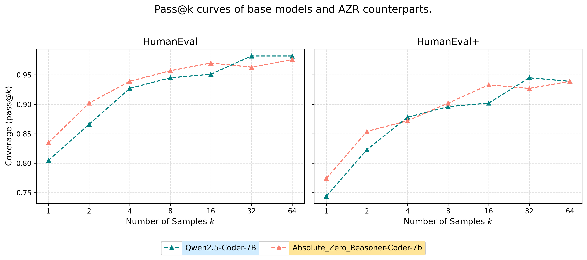

# 🧪 A Simple Attempt to Evaluate AZR with pass@k

This repo contains a small-scale experiment where I tried to evaluate Absolute Zero Reasoner (AZR) using the pass@k metric on two coding benchmarks: HumanEval and HumanEval+.

## 🌱 Background & Motivation

After reading these two very inspiring papers:
* 📄 [Does Reinforcement Learning Really Incentivize Reasoning Capacity in LLMs Beyond the Base Model?](https://arxiv.org/pdf/2504.13837)
* 📄 [Absolute Zero: Reinforced Self-play Reasoning with Zero Data](https://arxiv.org/pdf/2505.03335)

I started wondering:

Could `pass@k` be used to analyze what **AZR** actually improves — is it discovering new reasoning paths, or mainly shifting probabilities toward known good completions?

A few days ago, I happened to have some free time, so I decided to run a small experiment myself to explore this question — **just a quick observation, nothing rigorous**. Fortunately, the [EvalPlus](https://github.com/evalplus/evalplus) framework made it easy to get started with pass@k evaluation on both HumanEval and HumanEval+.

# 🚧 What I Did

With a single RTX 3090 and limited compute, I ran a simple evaluation using the following two models:
* Qwen2.5-Coder-7B (base model)
* Absolute_Zero_Reasoner-Coder-7B (RL-finetuned via AZR)

on:
* HumanEval
* HumanEval+

using pass@k at k = [1, 2, 4, 8, 16, 32]. 

To keep the setting consistent with the **Limit-of-RLVR** paper, I followed the same decoding parameters:

- **Temperature**: 0.6  
- **Top-p sampling**: 0.95  

This is just a preliminary test and not an exhaustive benchmarking effort — mainly a small-scale exploration out of personal interest.

This was not a comprehensive experiment — just a first look to get a rough sense of how AZR behaves under this metric.

# 📊 `pass@k` Results on HumanEval (HE) and HumanEval+ (HE+)

| pass@k               | Qwen2.5-Coder-7B (HE) | Qwen2.5-Coder-7B (HE+) | AZR-Coder-7B (HE) | AZR-Coder-7B (HE+) |
|----------------------|-----------------------|-------------------------|--------------------|---------------------|
| 1 (Greedy Decoding)  | 0.835                 | 0.787                   | 0.890              | 0.817               |
| 1                    | 0.805                 | 0.744                   | 0.835              | 0.774               |
| 2                    | 0.866                 | 0.823                   | 0.902              | 0.854               |
| 4                    | 0.927                 | 0.878                   | 0.939              | 0.872               |
| 8                    | 0.945                 | 0.896                   | 0.957              | 0.902               |
| 16                   | 0.951                 | 0.902                   | 0.970              | 0.933               |
| 32                   | 0.982                 | 0.945                   | 0.963              | 0.927               |
| 64                   | 0.982                 | 0.939                   | 0.976              | 0.939               |

You can find the full experiment results here on [Google Drive](https://drive.google.com/drive/folders/1WO25GWWeAUC42Qr8wvVnw8G9Y6xtYqOr?usp=sharing).

## TODO

This experiment was conducted on a single RTX 3090 GPU, so due to **limited compute and time**, I only evaluated on HumanEval and HumanEval+.

If you're interested in this line of inquiry, it would be exciting to extend the evaluation to other reasoning-focused benchmarks such as:

- **MBPP / MBPP+**
- **CRUXEval**

These could provide a broader view of how AZR generalizes across diverse reasoning tasks.

## 💬 Why Share This?

Mainly to document my own curiosity — and perhaps spark discussion or inspire others to explore further.

I'm especially intrigued by how **reinforcement learning methods**, especially **RLVR**, might help llms *actively discover better reasoning chains* rather than just mimic existing patterns. Can models truly learn to think more effectively through self-exploration?

This small experiment was a first step for me in trying to understand that question a bit better.

If you’ve tried something similar, or have thoughts on this topic, I’d love to hear from you.